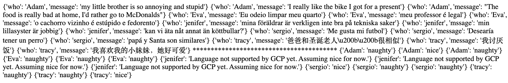

# Challenge:
Write a serverless application that helps Santa figure out if a given child is being naughty or nice based on what they've said. You'll likely need to detect the language of the correspondence, translate it, and then perform sentiment analysis to determine whether it's naughty or nice.

Have a look at the API https://aka.ms/holiday-wishes to find a sample of messages to validate whether your solution will work for Santa and his elves.

Solution to Day 5 of the #25DaysOfServerless. This solution use a GCP Cloud Function.

I uploaded the logic in this repo to a Cloud with default settings (function to execute set to main of course) after I enabled the Cloud Language API. I didn't have to add any logic to detect the language since that is automatic on GCP. However, there is, at the moment, limit to the languages that will work with the API. Current list here: https://cloud.google.com/natural-language/docs/languages

Preview:
